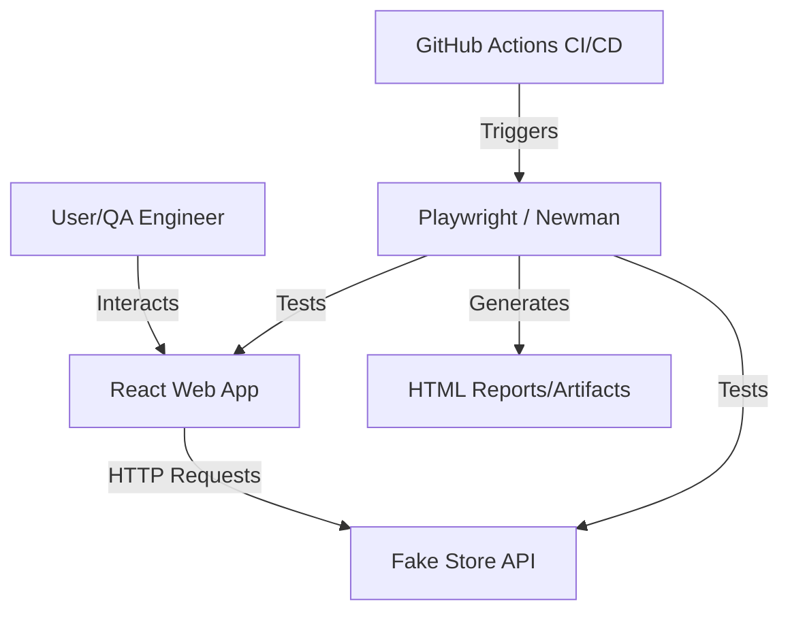

# FakeStore Project

This repository contains a web application built with React and a QA suite for API automation.

## Project Structure

- `app/`: The web application built with React, Vite, TypeScript, and Tailwind CSS.
- `qa/`: The API automation suite using Postman/Newman.

## Web Application (`app/`)

The web application consumes the [FakeStoreAPI](https://fakestoreapi.com/) and is designed for web automation practice.

### Tech Stack
- **React** (Vite)
- **TypeScript**
- **Tailwind CSS**
- **Axios** for API calls
- **React Router** for navigation

### Features
- **Login Page**: Protected routes (demo credentials: `mor_2314` / `83r5^_`).
- **Home Page**: Product catalog with loading and error states.
- **Product Details**: Comprehensive view of individual products.
- **Shopping Cart**: Full cart management (add, remove, clear).
- **Responsive Design**: Works on mobile and desktop.

### Getting Started

1.  Navigate to the `app` folder:
    ```bash
    cd app
    ```
2.  Install dependencies:
    ```bash
    npm install
    ```
3.  Run the development server:
    ```bash
    npm run dev
    ```
4.  Open [http://localhost:5173](http://localhost:5173) in your browser.

### Architecture Diagram



## Getting Started

Detailed instructions can be found in the [QA README](qa/README.md).
