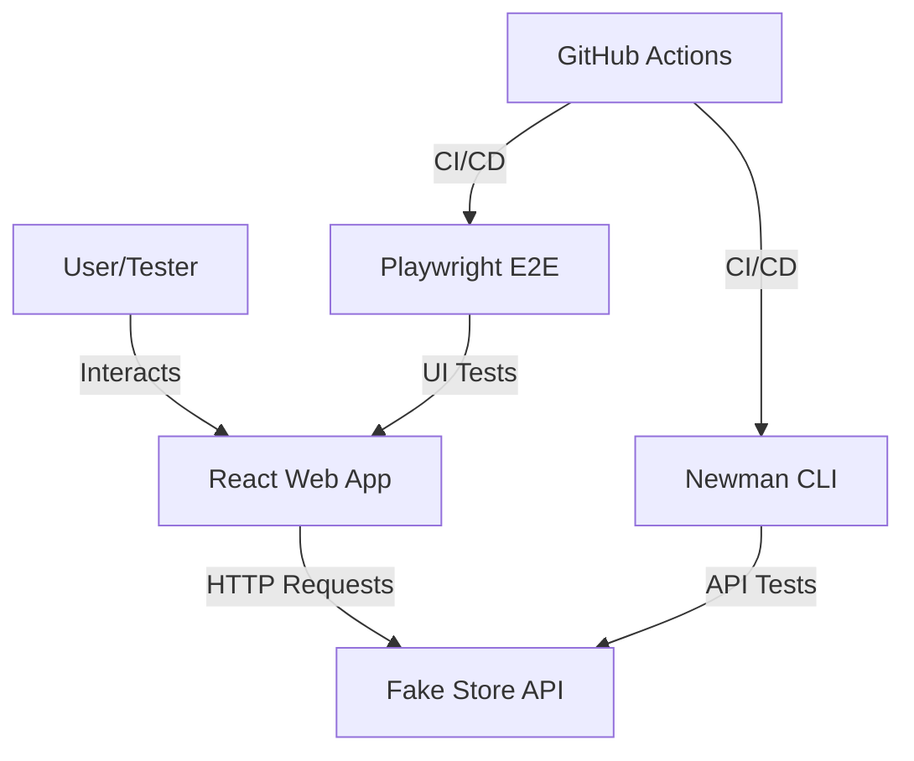

# Fake Store App

A modern, responsive e-commerce application built with React, TypeScript, and Tailwind CSS, powered by the [Fake Store API](https://fakestoreapi.com/).

## 🚀 Features

- **Browse Products**: View a comprehensive list of products with high-quality images and categories.
- **Search**: Real-time search functionality to find your favorite items instantly.
- **Filter**: Narrow down products by categories like electronics, jewelery, and clothing.
- **Detailed View**: Click on any product to see its full description, price, and ratings.
- **Shopping Cart**: Seamlessly add items to your cart, manage quantities, and proceed to a simulated checkout.
- **Responsive Design**: Optimized for a flawless experience across desktop, tablet, and mobile devices.
- **E2E Testing**: Robust end-to-end testing suite using Playwright.
- **API Testing**: Automated API validation suite using Postman and Newman.

## 🛠️ Tech Stack

- **Framework**: [React 19](https://react.dev/)
- **Build Tool**: [Vite](https://vitejs.dev/)
- **Language**: [TypeScript](https://www.typescriptlang.org/)
- **Styling**: [Tailwind CSS](https://tailwindcss.com/)
- **Icons**: [Material Icons](https://fonts.google.com/icons)
- **Testing**: [Playwright](https://playwright.dev/), [Newman](https://www.npmjs.com/package/newman)

## 🏃 How to Run the Project

### Prerequisites

Ensure you have [Node.js](https://nodejs.org/) installed (v18 or higher recommended).

### Installation

1. Clone the repository and navigate to the project folder:
   ```bash
   cd fakestore
   ```

2. Install dependencies for both the application and the QA suite:
   ```bash
   # Install App dependencies
   cd app
   npm install
   
   # Install QA dependencies
   cd ../qa
   npm install
   ```

3. Install Playwright browsers:
   ```bash
   cd ../app
   npx playwright install
   ```

### Running Development Server

Start the local development server for the web app:
```bash
cd app
npm run dev
```
The app will be available at `http://localhost:5173` (or the port specified in the console).

---

## 🧪 Testing with Playwright
g
We use Playwright for end-to-end testing to ensure the application works as expected.

### Running Tests

1. To run all tests in headless mode:
   ```bash
   cd app
   npx playwright test
   ```

2. To run tests in **UI mode** (Interactive):
   ```bash
   npx playwright test --ui
   ```

3. To view the last test report:
   ```bash
   npx playwright show-report
   ```

### Testing Results Summary
Our test suite covers:
- **Positive Scenarios**: Home page loading, search functionality, category filtering, and full checkout flow.
- **Negative Scenarios**: Proper handling of "not found" states for invalid product IDs and incorrect login credentials.

---

## 🔬 API Testing with Newman

We use Newman (Postman CLI) for automated API testing.

### Running API Tests

1. Navigate to the `qa` folder:
   ```bash
   cd qa
   ```

2. Run the Postman collection:
   ```bash
   npm test
   ```

3. View reports:
   - **HTML Report**: `qa/reports/report.html`
   - **PDF Report**: `qa/reports/report.pdf`

---

## 🏗️ Architecture Diagram



---

## 📂 Project Structure

- `app/src/App.tsx`: Main application component containing routing and logic.
- `app/tests/e2e.spec.ts`: Playwright E2E test suite using POM.
- `qa/collections/`: Postman API collections for automated testing.
- `app/playwright.config.ts`: Configuration for Playwright testing.
- `app/vite.config.js`: Configuration for the Vite build tool.
